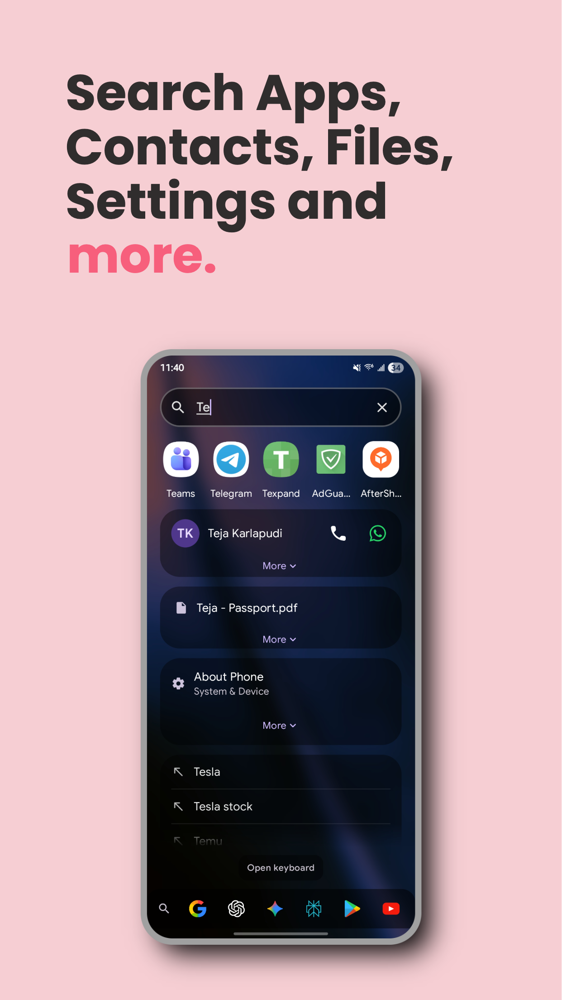
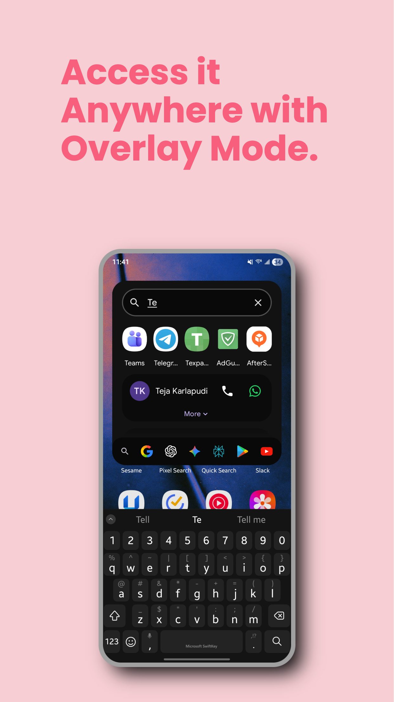
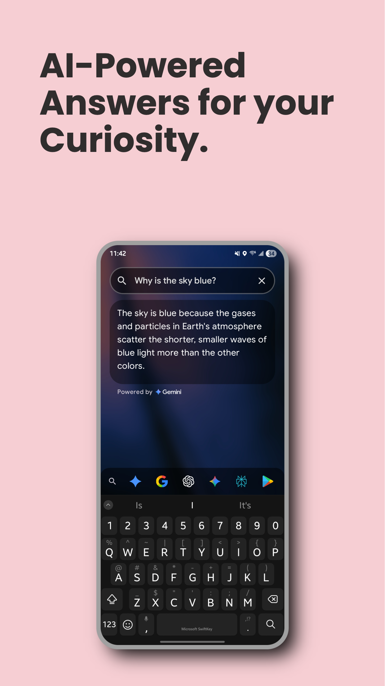
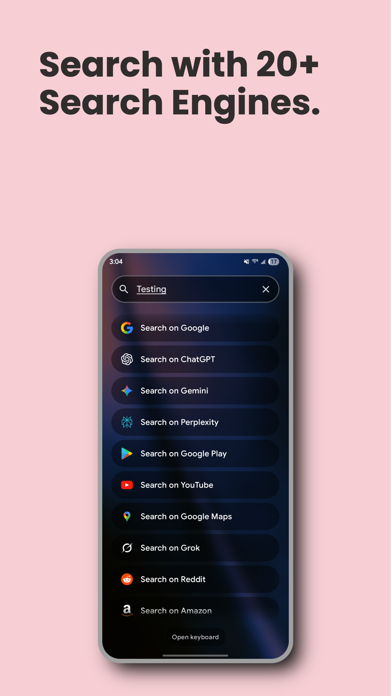
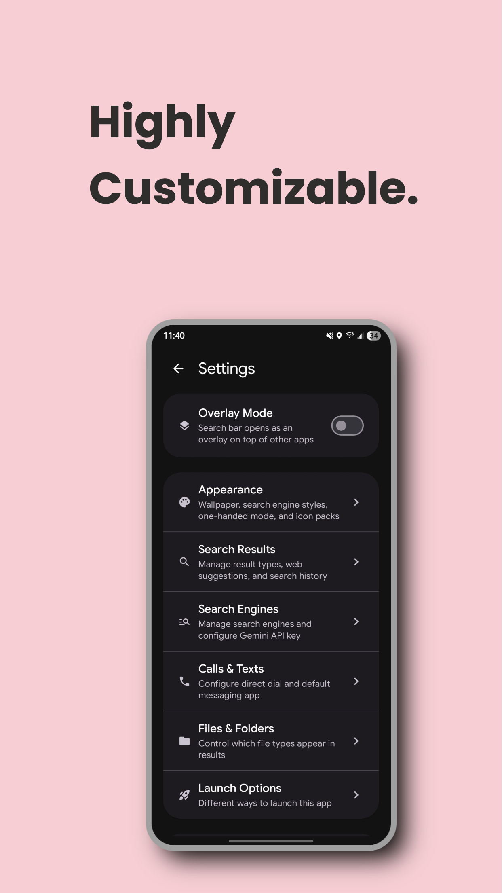

# Quick Search

A fast & powerful Android app that lets you search across **apps, contacts, device files, device settings, web, and basic calculations** from a single screen. Built with Kotlin and Jetpack Compose using Material 3 design.

<table width="100%">
  <tr>
    <td align="left" valign="middle">
      <a href="https://play.google.com/store/apps/details?id=com.tk.quicksearch"></a>
      <a href="https://github.com/teja2495/quick-search/releases/latest"></a>
    </td>
    <td align="right" valign="middle">
      <a href="https://paypal.me/teja2495"></a>
    </td>
  </tr>
</table>

[](https://opensource.org/licenses/MIT)

## 📸 Screenshots

| | | |
|---|---|---|
|  |  |  |
|  |  |  |

## ✨ Key Features

### 🔍 Unified Search
- **Apps**: Search and launch installed applications with smart ranking. App search ignores typos and allows abbreviations. Long press apps to access their shortcuts (if available); shortcuts appear in search results too.
- **Contacts**: Find and call/text contacts with multi-number support and WhatsApp/Telegram/Google Meet integration. Long press contact actions to customize them.
- **Files**: Search device files and folders (images, videos, documents, etc.)
- **Settings**: Search Android system settings
- **Web**: Integrated search engines with customizable shortcuts and Google-powered suggestions (choose how many to display). Browsers can be added as search engines.
- **Calculator**: Built-in calculator for math expressions (+, -, *, /, brackets)
- **Gemini API**: Direct search can be enabled by configuring your own Gemini API key

### 🎯 Smart Features
- **Overlay Mode**: Enable to make the search bar appear over other apps, anywhere—changes how you access search from any screen
- **Overlay Themes**: Multiple themes for overlay mode (access via search results settings)
- **App Nicknames**: Assign custom names to apps for easier searching
- **App Suggestions**: Shows recommended apps when search bar is empty
- **Direct Search**: AI-powered answers using Gemini API (optional); choose among several Gemini and Gemma models
- **Web Suggestions**: Google-powered search suggestions as you type
- **Multi-App Search**: Tap search engine icons to search within specific apps
- **Wallpaper Integration**: Automatic device wallpaper background with adjustable transparency and blur
- **Quick Settings Tile**: Instant access from Android Quick Settings
- **Assistant Integration**: Detects when app is set as default digital assistant
- **Icon Pack Support**: Integration with icon pack launchers
- **Optional Single-hand friendly Layout**: Results appear at the bottom of the screen for easier access.
- **Section Ordering**: Customize which content appears first
- **Pinned Results**: Keep favorite results always visible
- **Recent Apps**: Smart ranking based on usage patterns
- **Recent Searches**: Show recent searches across all types (files, contacts, settings, apps, web, etc.) when the search bar is empty (choose how many to display, default is 3)
- **Haptic Feedback**: Context-aware vibration feedback for different interactions (tap, toggle, etc.)
- **In-App Updates**: Automatic prompts for app updates from Play Store
- **In-App Reviews**: Smart prompts to rate the app based on usage patterns
- **Release Notes**: View what's new in each version directly in the app
- **Feedback System**: In-app feedback options via email

### 📱 Widget Support
- Home screen widget with customizable appearance
- **Custom widget buttons**: Add apps, shortcuts, files, contacts, and settings directly to your widget
- Configurable colors, borders, and labels
- Instant access to search functionality
- Voice search with microphone button for hands-free searching

### 🔐 Privacy-Focused
- Local processing by default
- Encrypted storage for sensitive data
- Granular permission controls
- No ads or analytics

## 🚀 Installation

### Requirements
- Android 7.0 (API 24) or higher
- Target SDK: Android 15 (API 36)

### Build from Source
```bash
# Clone the repository
git clone https://github.com/teja2495/quick-search.git
cd quick-search

# Build with Gradle
./gradlew assembleRelease
```

### Download
- **Google Play Store**: Get the app from [Google Play Store](https://play.google.com/store/apps/details?id=com.tk.quicksearch) for automatic updates
- **APK Release**: Download the latest APK from the [Releases](https://github.com/teja2495/quick-search/releases) page

## 📖 Usage

### Getting Started
1. **Permissions**: On first launch, you'll be prompted for several optional permissions:
   - **Usage Access**: Shows recently used apps and usage statistics
   - **Contacts**: Access contact names and phone numbers for contact search
   - **Storage/Media**: Access device files for file search
   - **Phone**: Direct dial functionality (call without opening dialer)
   - **Query All Packages**: List installed applications
   All permissions are optional and can be granted later in Settings → Permissions
2. **Configure Search Engines**: Visit Settings → Search Engines to customize available search engines, set shortcuts, and optionally enable AI-powered answers with Gemini API
3. **Start Searching**: Type in the search field to find apps, contacts, files, web results, or calculate math expressions

### Quick Access
- **Quick Settings Tile**: Add Quick Search to Android Quick Settings for instant access
- **Home Screen Widget**: Add a customizable widget with custom buttons (apps, shortcuts, files, contacts, settings)
- **Overlay Mode**: Enable in settings to show the search bar over other apps, anywhere
- **Digital Assistant**: Set Quick Search as your device's default digital assistant for enhanced search integration

### Search Shortcuts
Configure custom keyboard shortcuts for search engines and add them at the start of a query to quickly trigger the respective search engine:
- `ggl` → Google
- `ytb` → YouTube
- `mps` → Google Maps
- And more...

### Direct Search
Enable AI-powered answers by:
1. Getting a Gemini API key from [Google AI Studio](https://makersuite.google.com/app/apikey)
2. Adding the key in Settings → Search Engines → Direct Search
3. Optionally add personal context for better answers

## ⚙️ Configuration

### Search Engines
- **Supported** (22 total): Google, ChatGPT, Perplexity, Grok, Gemini, Google Maps, Google Play, Reddit, YouTube, Amazon, Bing, Brave, DuckDuckGo, Facebook Marketplace, Google Drive, Google Meet, Google Photos, Spotify, Startpage, X/Twitter, You.com, YouTube Music, Google AI Mode
- **Browsers**: Add installed browsers as search engines
- **Customizable**: Reorder, enable/disable, and set shortcuts
- **Direct Search**: AI answers with Gemini API integration; choose among several Gemini and Gemma models; optional personal context
- **Style**: Choose between inline (scrolls with content) or compact (fixed at bottom)

### Sections
Toggle and reorder search result sections:
- Apps (always visible)
- Contacts (requires permission)
- Files (requires permission)
- Settings (device shortcuts)
- Calculator (built-in math expressions)

### File Types
Filter which file types to include in search:
- Photos & Videos
- Documents
- Other files

### Result Management
- **Exclude Items**: Long press any result to hide it from future searches
- **File Type Filtering**: Exclude specific file types from search results
- **App Management**: View app details or bulk uninstall apps (access via search results settings)
- **Shortcut Management**: Enable, disable, or add custom app shortcuts (access via search results settings)

### Appearance
- **Wallpaper background**: Adjust transparency and blur of the device wallpaper background

### Contact Preferences
- Choose default messaging app (Messages, WhatsApp, Telegram)
- **Customize contact actions**: Long press any contact action to change it
- Google Meet integration for video calls
- Enable direct dial (call without opening dialer)
- Set preferred numbers per contact ("Remember my choice")
- Support for multiple phone numbers per contact

## 🔑 Permissions

Quick Search follows a privacy-first approach with minimal required permissions.

### Required
- **Usage Access** (`PACKAGE_USAGE_STATS`): Required to show recently used apps and usage statistics

### Optional
- **Contacts**: Access contact names and phone numbers for contact search
- **Storage/Media**: Access device files for file search
- **Phone**: Direct dial functionality (call without opening dialer)
- **Query All Packages**: List installed applications

## 🛡️ Privacy

Quick Search prioritizes your privacy. All search processing happens locally on your device. For detailed information, see our [Privacy Policy](PRIVACY_POLICY.md).

**Key Points:**
- No ads or analytics
- Encrypted storage for API keys
- Granular permission controls
- Local data processing

## 🏗️ Architecture

Built with modern Android development practices:

- **Language**: Kotlin 2.0.21
- **UI**: Jetpack Compose with Material 3 (BOM 2025.12.01)
- **Architecture**: MVVM with ViewModels and StateFlow (unidirectional data flow)
- **State Management**: Single source of truth with sealed classes for type-safe states
- **Persistence**: SharedPreferences with encryption for sensitive data (Gemini API keys)
- **Widgets**: Jetpack Glance App Widget framework
- **Build System**: Gradle Kotlin DSL (8.12.3) with version catalogs
- **Min SDK**: 24 (Android 7.0) | **Target SDK**: 36 (Android 15)

### Project Structure
```
app/src/main/java/com/tk/quicksearch/
├── app/            # Application entry point (MainActivity)
├── navigation/     # Navigation management with animated transitions
├── onboarding/     # First-launch setup flow
├── permissions/    # Permission handling
├── search/         # Main search functionality
│   ├── models/     # Data models (AppInfo, ContactInfo, etc.)
│   ├── data/       # Repositories and preferences
│   │   └── preferences/ # Modular preference classes
│   ├── core/       # Core search logic and ViewModel
│   ├── apps/       # App search components
│   ├── contacts/   # Contact search and messaging integration
│   ├── files/      # File search components
│   ├── deviceSettings/ # Device settings search
│   ├── searchEngines/  # Search engine integration
│   ├── calculator/ # Calculator functionality
│   ├── searchScreen/   # Main search UI components
│   ├── handlers/   # Specialized handlers (pinning, shortcuts)
│   └── common/     # Shared utilities
├── settings/       # Settings screens
│   ├── main/       # Main settings UI
│   ├── appearance/ # Visual customization settings
│   ├── searchEngines/ # Search engine configuration
│   ├── components/ # Reusable settings components
│   └── permissions/# Permission settings
├── tile/           # Quick Settings tile service
├── ui/theme/       # Material 3 theming and design tokens
├── util/           # Utility functions (ranking, phone numbers, etc.)
└── widget/         # Home screen widget (Glance)
```

### Key Architectural Patterns
- **Feature-based organization**: Code organized by feature domain
- **Repository pattern**: Data layer abstraction
- **Sealed classes**: Type-safe state management
- **Three-phase initialization**: Optimized startup performance
- **Modular preferences**: Specialized preference management classes


## ☕ Support the Development

If you find Quick Search helpful, consider supporting the development:

- **Cash App**: [$teja2495](https://cash.app/$teja2495)
- **Venmo**: [@teja2495](https://account.venmo.com/u/teja2495)

## 📄 License

This project is licensed under the MIT License - see the [LICENSE](LICENSE) file for details.

## 📞 Contact

- **Email**: tejakarlapudi.apps@gmail.com
- **Issues**: [GitHub Issues](https://github.com/teja2495/quick-search/issues)

---

**Made with ❤️ for Android**
