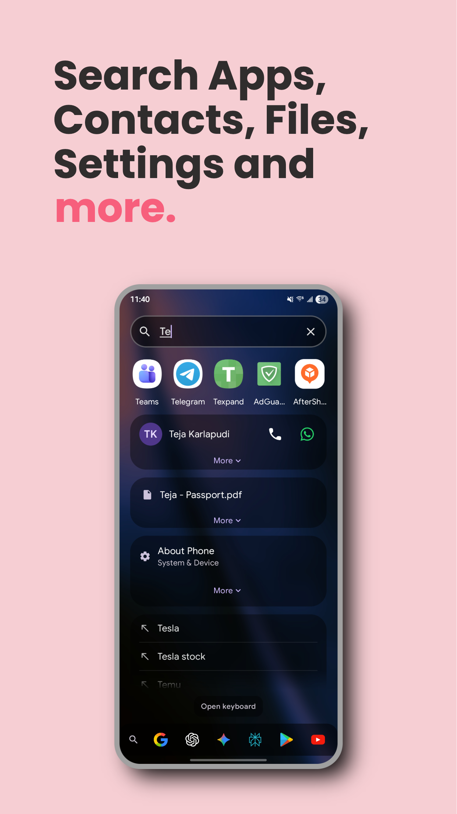
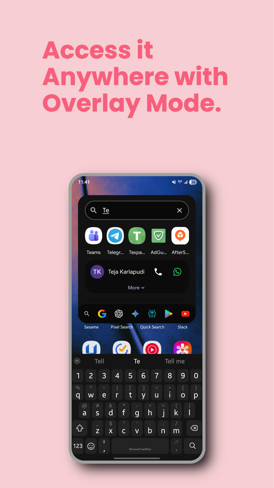
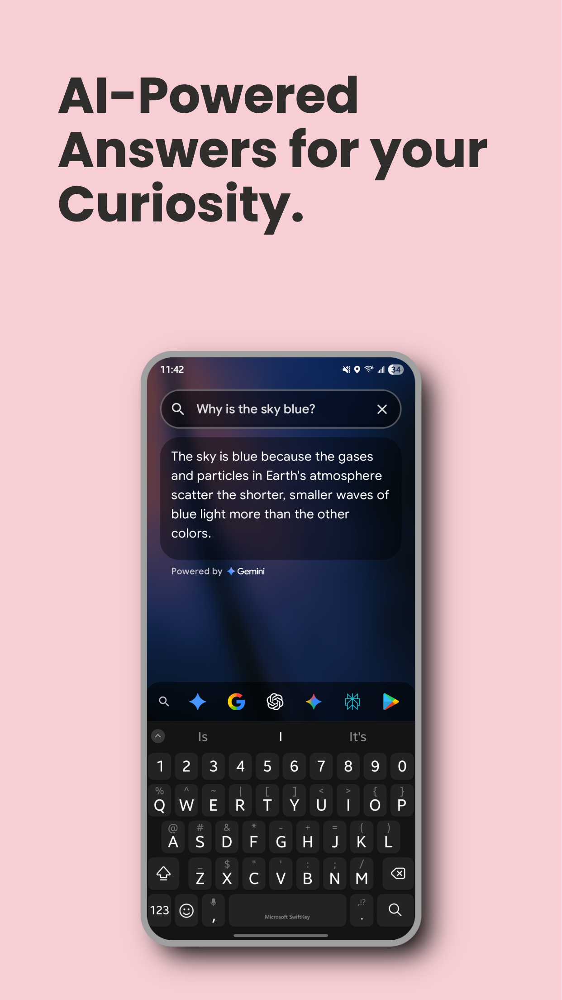
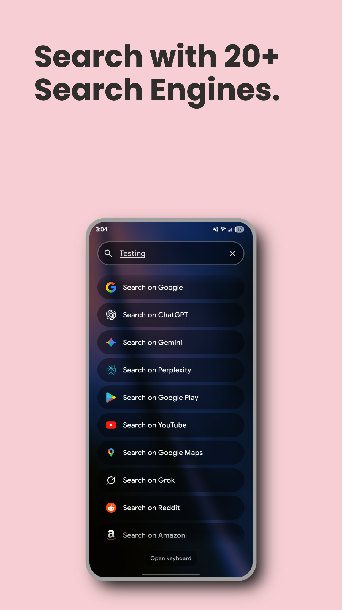
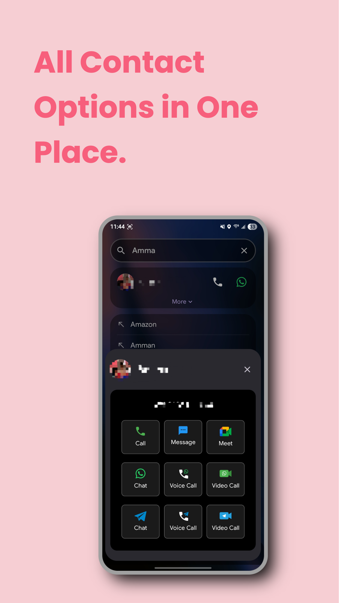
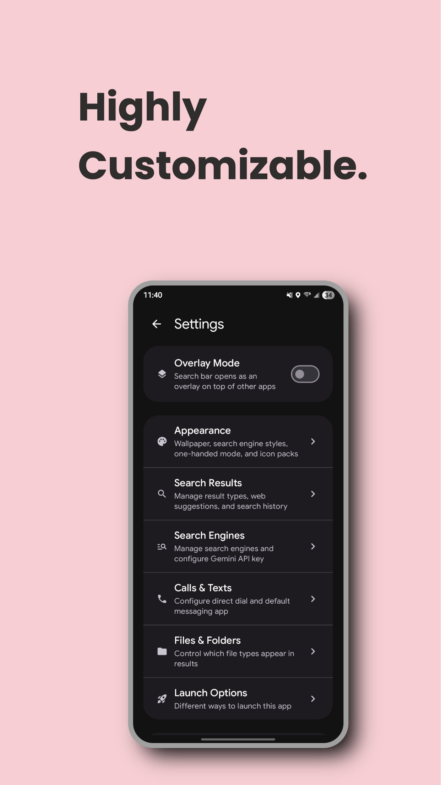

# Quick Search

A fast & powerful Android app that lets you search across **apps, contacts, device files, device settings, web, and basic calculations** from a single screen. Built with Kotlin and Jetpack Compose using Material 3 design.

<a href="https://play.google.com/store/apps/details?id=com.tk.quicksearch"></a>
<a href="https://github.com/teja2495/quick-search/releases/latest"></a>

[](https://opensource.org/licenses/MIT)

## 📸 Screenshots

| | | |
|---|---|---|
|  |  |  |
|  |  |  |

## ✨ Key Features

### 🔍 Unified Search
- **Apps**: Search and launch installed applications with smart ranking. App search ignores typos and allows abbreviations. Long press apps to access their shortcuts (if available); shortcuts appear in search results too.
- **Contacts**: Find and call/text contacts with multi-number support and WhatsApp/Telegram/Google Meet integration. Long press contact actions to customize them.
- **Files**: Search device files and folders (images, videos, documents, etc.)
- **Device Settings**: Search Android system settings
- **Web**: Search the web using 20+ search engines with customizable shortcuts and web suggestions. Browsers can be added as search engines.
- **Calculator**: Built-in calculator for math expressions (+, -, *, /, brackets)
- **Gemini API**: Direct search can be enabled by configuring your own Gemini API key
- **Overlay Mode**: Enable to make the search bar appear over other apps, anywhere—changes how you access search from any screen
- **Home Screen Widget**: Home screen widget with customizable appearance. Add custom buttons which trigger - apps, shortcuts, files, contacts, and settings.
- **Launch Options**: Widget, Quick Settings Tile & Digital Assistant

### Search Shortcuts
Configure custom keyboard shortcuts for search engines and add them at the start of a query to quickly trigger the respective search engine:
- `ggl` → Google
- `ytb` → YouTube
- `mps` → Google Maps
- And more...

### Direct Search
Enable AI-powered answers by:
1. Getting a Gemini API key from [Google AI Studio](https://makersuite.google.com/app/apikey)
2. Adding the key in Settings → Search Engines → Direct Search
3. Optionally add personal context for personalized answers
4. Choose any Gemini/Gemma models of your choice

### Search Engines
- **Supported** (20+): Google, ChatGPT, Perplexity, Grok, Gemini, Google Maps, Google Play, Reddit, YouTube, Amazon, Bing, Brave, DuckDuckGo, Facebook Marketplace, Google Drive, Google Meet, Google Photos, Spotify, Startpage, X/Twitter, You.com, YouTube Music, Google AI Mode, Claude.
- **Browsers**: Add installed browsers as search engines
- **Direct Search**: AI answers with Gemini API integration; choose among several Gemini and Gemma models; optional personal context
- **Style**: Choose between inline or compact styles

[View all features](features.md)

## 🚀 Installation

### Requirements
- Android 7.0 (API 24) or higher
- Target SDK: Android 15 (API 36)

### Build from Source
```bash
# Clone the repository
git clone https://github.com/teja2495/quick-search.git
cd quick-search

# Build with Gradle
./gradlew assembleRelease
```

### Download
- **Google Play Store**: Get the app from [Google Play Store](https://play.google.com/store/apps/details?id=com.tk.quicksearch) for automatic updates
- **APK Release**: Download the latest APK from the [Releases](https://github.com/teja2495/quick-search/releases) page

## 🛡️ Permissions & Privacy

Quick Search prioritizes your privacy. All permissions are optional, only used to unlock additional features. All search processing happens locally on your device. For detailed information, see our [Privacy Policy](PRIVACY_POLICY.md).

**Key Points:**
- No ads or analytics
- Encrypted storage for API keys
- Granular permission controls
- Local data processing

## 🏗️ Architecture

Built with modern Android development practices:

- **Language**: Kotlin 2.0.21
- **UI**: Jetpack Compose with Material 3 (BOM 2025.12.01)
- **Architecture**: MVVM with ViewModels and StateFlow (unidirectional data flow)
- **State Management**: Single source of truth with sealed classes for type-safe states
- **Persistence**: SharedPreferences with encryption for sensitive data (Gemini API keys)
- **Widgets**: Jetpack Glance App Widget framework
- **Build System**: Gradle Kotlin DSL (8.12.3) with version catalogs
- **Min SDK**: 24 (Android 7.0) | **Target SDK**: 36 (Android 15)

### Project Structure
```
app/src/main/java/com/tk/quicksearch/
├── app/                    # Application entry (MainActivity, release notes, review, updates)
├── navigation/             # Navigation with animated transitions
├── onboarding/             # First-launch setup flow
│   └── permissionScreen/   # Permission request UI and state
├── search/                 # Main search functionality
│   ├── models/             # Data models (AppInfo, ContactInfo, DeviceFile, etc.)
│   ├── data/               # Repositories and preferences
│   │   └── preferences/    # Modular preference classes
│   ├── core/               # SearchViewModel, SearchModels, unified search, section management
│   ├── apps/               # App search, icons, management, fuzzy strategy
│   ├── appShortcuts/       # App shortcut search and actions
│   ├── contacts/           # Contact search (actions, components, dialogs, utils)
│   ├── files/              # File search and management
│   ├── deviceSettings/     # Device settings search
│   ├── searchEngines/      # Search engine integration
│   │   ├── compact/        # Compact mode UI
│   │   ├── inline/         # Inline mode UI
│   │   └── shared/         # Shared search engine components
│   ├── webSuggestions/     # Web search suggestions
│   ├── searchHistory/     # Recent items tracking and display
│   ├── fuzzy/              # Fuzzy search engine
│   ├── overlay/            # Overlay mode (search over other apps)
│   ├── searchScreen/       # Main search UI (layout, scroll, sections, dialogs)
│   └── common/             # Pinning, ranking, shared utilities
├── tools/                  # Specialized tools and utilities
│   ├── calculator/         # Calculator functionality
│   └── directSearch/       # Direct Search (Gemini API, model picker)
│   ├── webSuggestions/     # Web search suggestions
│   ├── searchHistory/     # Recent items tracking and display
│   ├── fuzzy/              # Fuzzy search engine
│   ├── overlay/            # Overlay mode (search over other apps)
│   ├── searchScreen/       # Main search UI (layout, scroll, sections, dialogs)
│   └── common/             # Pinning, ranking, shared utilities
├── settings/               # Settings screens
│   ├── searchEnginesScreen/# Search engine configuration
│   ├── settingsDetailScreen/ # Detail screens (appearance, files, permissions, etc.)
│   └── shared/             # Settings route and shared components
├── tile/                   # Quick Settings tile service
├── ui/
│   ├── theme/              # Material 3 theming and design tokens
│   └── components/         # Reusable UI components
├── util/                   # Device, wallpaper, haptic, feedback utilities
└── widget/                 # Home screen widget (Glance)
    ├── customButtons/      # Widget button actions and config
    └── voiceSearch/        # Voice search for widget
```

### Key Architectural Patterns
- **Feature-based organization**: Code organized by feature domain
- **Repository pattern**: Data layer abstraction
- **Sealed classes**: Type-safe state management
- **Three-phase initialization**: Optimized startup performance
- **Modular preferences**: Specialized preference management classes


## 📄 License

This project is licensed under the MIT License - see the [LICENSE](LICENSE) file for details.

## 📞 Contact

- **Email**: tejakarlapudi.apps@gmail.com
- **Issues**: [GitHub Issues](https://github.com/teja2495/quick-search/issues)

---

**Made with ❤️ for Android**
